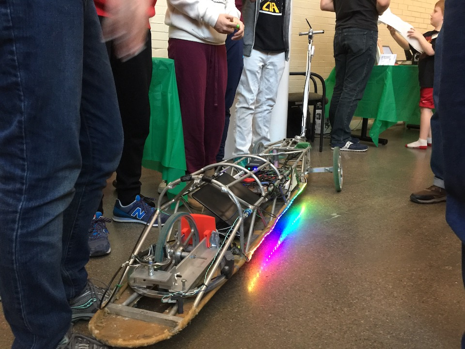
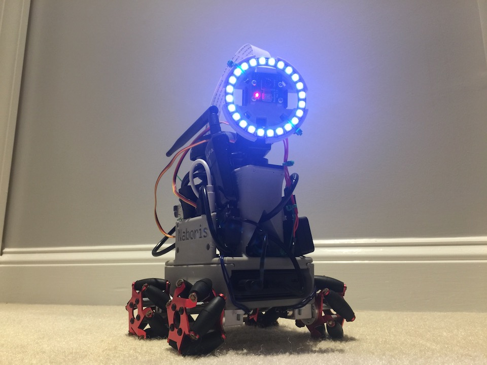

Welcome to the atlasbuggy repository! This readme will serve as a high level design document. This code package is an attempt at making developing DIY robots easy, fun, and pythonic.

# Table of Contents
1. [Software setup](#setup)
    1. [Dependencies](#dependencies)
1. [Background](#background)
    1. [Why does this project exist?](#why)
    1. [How will we fulfill this purpose?](#how)
    1. [What does this require?](what)
    1. [When will this project finish?](#when)
    1. [Who does this project involve?](#who)
    1. [Where will the final product fit in with the rest of Atlas](#where)
1. [Examples](#examples)
    1. [Video player](examples/camera_demos/video_demo.md)
    1. [Simple Arduino reader and writer](examples/serial_demos/reader_writer.md)

# Software setup <a name="setup"></a>
## Dependencies

Atlasbuggy mostly uses modules in python's standard library. So the only critical dependency is python 3.5 or higher. Atlasbuggy utilizes asyncio which was made standard in 3.5.<br/><br/>

Most dependencies can be installed with python's "pip." Depending on your installation, pip can be run by either typing "pip" or "pip3" in the terminal. Make sure you know what version of pip you have so you don't install modules to the wrong place! I'm going to assume you're on macOS or linux and pip is installed under pip3.

If you encounter permission errors on macOS or linux, try adding ```sudo``` to the beginning of your command.

However, there are some dependencies you'll want to get if you want to get the most out of this repository:

1. pyserial - for working with usb serial devices such as arduino

    ```bash
    pip3 install pyserial
    ```
1. opencv - for camera visualization. https://www.pyimagesearch.com has some great tutorials on how to get this set up
1. flask - website hosting for remote control of robots

    ```bash
    pip3 install flask
    ```    
1. matplotlib - for data visualization

    ```bash
    pip3 install matplotlib
    ```
1. picamera - for accessing the raspberry pi camera (obviously only get this if you're on a raspberry pi)

    ```bash
    pip3 install picamera
    ```    
1. scipy and numpy - advanced matrix manipulation. Essential for autonomous algorithms. (Numpy is a dependency of scipy and opencv)
    ```bash
    pip3 install numpy scipy
    ```

That should be it!

## Installation
Since atlasbuggy is not on pip, you can't install it that way. Python packages are installed in either dist-packages or site-packages on your computer somewhere.

### macOS and linux instructions
Boot up your terminal application and download the repository into the directory of your choice. It will create a folder called atlasbuggy and fill it with the repository:

```bash
git clone https://github.com/AtlasBuggy/atlasbuggy.git
```

To find this directory, type the following:

```bash
$ python3  # or whatever command starts the python repl for you
>>> import sys
>>> sys.path
```

Look for the path that ends with ```site-packages```. If you can't find it, sys.path lists every path it checks for modules in. Search those directories until you find site-packages.

On macOS and linux, to create a link between folders (or a symlink), type the following:

```bash
sudo ln -s $PWD/atlasbuggy /usr/local/lib/python3.6/site-packages
```

This is assuming my site-packages folder is called /usr/local/lib/python3.6/site-packages, I've installed atlasbuggy in ~/Documents, and I'm currently in the Documents directory. It's important to symlink absolute directories (not ../some_other_directory) so that links don't confused. $PWD inserts the current directory you're in. This operation requires administrator privileges.

Try it out:

```python
python3
>>> import atlasbuggy
>>> atlasbuggy.get_platform()  # for me this returns 'mac'
mac
```

## Development environment
I highly recommend PyCharm if you're developing in python: https://www.jetbrains.com/pycharm/. It's a battery guzzler, but it's free and offers some really fantastic features like jump to definition, code reformatting, and refactoring (moving and renaming elements without breaking code) to name a few. It's not necessary but PyCharm is worth at least checking out.

If you plan on creating your own robot, I recommend getting an SFTP and SSH client. Most robots run headless (without a display). SFTP and SSH allow you to access another computer's file system and terminal remotely provided you know the address, username, and password and the computer is broadcasting itself. I won't give details here since everyone's setup varies. For macOS users, I recommend Transmit by Panic (https://www.panic.com/transmit/).

# Background <a name="background"></a>
## Why does this project exist? <a name="why"></a>

Developing robotic systems is difficult. ROS (http://www.ros.org) made me an unhappy programmer, so I decided to write my own robotics development package; one that I would enjoy working with.<br/>

I used this framework I created on two robots:
RoboQuasar (URL on the way),




and Naboris (https://github.com/AtlasBuggy/Naboris)




I've had a fun time developing this platform. My goal is to offer people frustrated with ROS an alternative.

## How will we fulfill this purpose? <a name="how"></a>

By creating a pythonic collection of code that lets vastly different pieces of software play nice together independent of hardware platform. This should sound familiar to ROS. The only difference is the implementation and a few key design decisions.

## What does this require? <a name="what"></a>

We need a way of managing data transfer, low level hardware devices, high level algorithms, and user interfaces and a way to make all of this manageable and accessible.<br/><br/>

This translates to concurrency and multitasking, low level byte transfer via protocols, subscriptions, and microcontroller programming. Thankfully, Python and Arduino (as well as other languages and platforms) makes this feasible and, for some, fun. All of these concepts will be detailed in the coming sections.

## When will this project finish? <a name="when"></a>

This project is a portion of a larger autonomous vehicle project. The repository can already pilot complex robotics systems, but has yet to get the autonomous vehicle across the finish line. So the main deadline as of now is April 2018, but hopefully the project will continue indefinitely.<br/><br/>

Generally, the timeline is get the repository tested and running before returning to the main robot in fall, make sure the old low level Arduino code on the main robot still works with current system (there should be minimal changes), get manual mode operational, develop autonomous algorithms with the available sensors, perform tests, iterate until the deadline.

## Who does this project involve? <a name="who"></a>

The audience is primarily anyone on the Atlas team, but because of the flexible nature of the code, the audience is also anyone interested in building their own robot.

## Where will the final product fit in with the rest of Atlas? <a name="where"></a>

Atlasbuggy will be running on all of our robots including test rigs (such as Naboris). It will be running while the robot is driving the course and offline in simulations.

# Examples <a name="examples"></a>
Here's a collection of examples on how to use this repository effectively. I will be walking through code I've written on a high level. If you want to drive into the code, feel free. I'm doing my best to keep my comments up to date. The first two examples are in the examples folder. Each link redirects to the example's folder containing the walkthrough.

[Video player](examples/camera_demos/video_demo.md)

[Simple Arduino reader and writer](examples/serial_demos/reader_writer.md)
